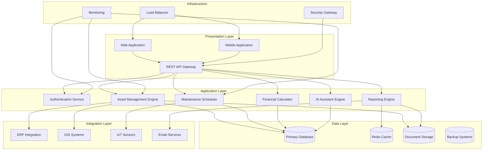
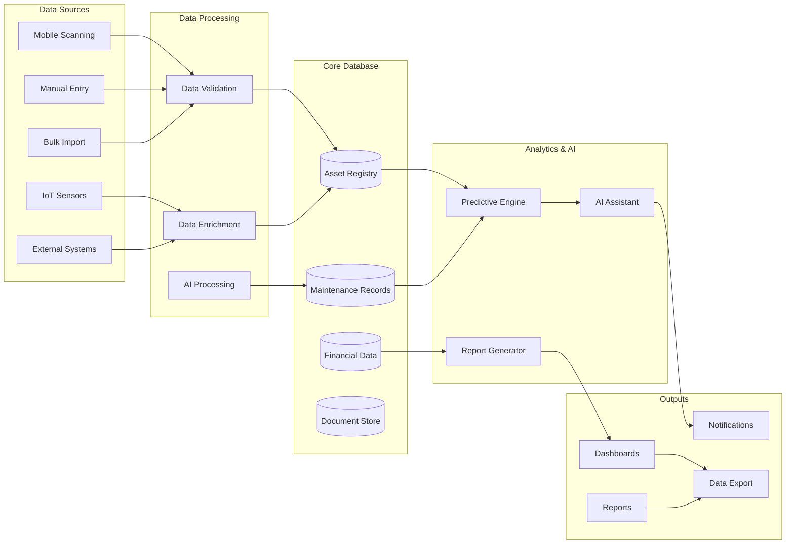
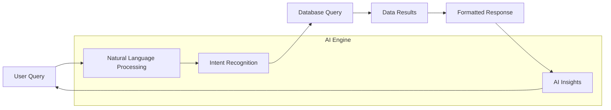

# SYSTEM CAPABILITIES DOCUMENT
## Municipal Asset Management System
**Submission for Government Tender**

---

## EXECUTIVE SUMMARY

AllIR Solutions presents a transformative Municipal Asset Management System designed specifically for South African municipalities. This comprehensive solution addresses the critical challenge of managing municipal assets throughout their entire lifecycle while ensuring full compliance with the Municipal Finance Management Act (MFMA) and Generally Recognised Accounting Practice (GRAP).

Our system combines cutting-edge technology with deep understanding of municipal operations, delivering an integrated platform that enhances operational efficiency, ensures regulatory compliance, and maximizes asset value. With AI-powered assistance, real-time tracking capabilities, and seamless integration with existing municipal systems, this solution empowers municipalities to make data-driven decisions while maintaining transparency and accountability.

The system is built on robust architecture that ensures scalability, security, and reliability - essential requirements for critical municipal infrastructure. Our solution not only meets current needs but is designed to evolve with changing regulatory requirements and technological advances.

---

## COMPREHENSIVE SYSTEM CAPABILITIES

### 🔧 Asset Lifecycle Management
**Complete cradle-to-grave asset tracking and management**

Our system provides end-to-end asset lifecycle management from initial acquisition through to disposal. The platform automatically tracks asset states, triggers appropriate workflows, and maintains comprehensive audit trails. Asset histories are preserved indefinitely, ensuring institutional knowledge retention and supporting informed decision-making.

- **Acquisition Management**: Streamlined procurement workflows with approval hierarchies
- **Deployment Tracking**: Real-time asset placement and utilization monitoring
- **Performance Monitoring**: Continuous assessment of asset efficiency and effectiveness
- **Disposal Workflows**: Compliant asset retirement processes with proper authorization

### 📱 Advanced Asset Identification & Mobile Operations
**Seamless field operations with intelligent tagging systems**

The system implements industry-standard barcode and QR code tagging, enabling instant asset identification and data capture. Our mobile application ensures field staff can perform asset management tasks even in areas with limited connectivity.

- **Intelligent Tagging**: Auto-generated unique identifiers with customizable formats
- **Mobile Scanning**: High-performance scanning with validation and error checking
- **Offline Capability**: Full functionality without internet connectivity
- **GPS Integration**: Automatic location capture and asset mapping
- **Field Updates**: Real-time asset status updates from mobile devices

### 🔧 Intelligent Maintenance Management
**Proactive maintenance strategies powered by predictive analytics**

Our maintenance module combines preventive scheduling with predictive analytics to minimize downtime and extend asset life. The system learns from historical data to optimize maintenance intervals and predict potential failures.

- **Preventive Scheduling**: Automated maintenance calendars based on usage and time
- **Corrective Workflows**: Streamlined repair processes with priority management
- **Resource Allocation**: Optimal scheduling of maintenance teams and materials
- **Performance Analytics**: Maintenance effectiveness tracking and optimization

### 💰 Financial Integration & Compliance
**Complete financial transparency with automated compliance reporting**

The system provides sophisticated financial tracking capabilities, ensuring accurate asset valuation and seamless integration with municipal financial systems.

- **Depreciation Calculations**: Multiple depreciation methods with automatic calculations
- **MFMA Compliance**: Automated compliance checking and reporting
- **GRAP Standards**: Full adherence to accounting standards
- **Budget Integration**: Real-time budget tracking and variance analysis
- **Cost Center Allocation**: Detailed cost tracking by department and project

### 📊 Real-Time Monitoring & Analytics
**Comprehensive visibility through intelligent dashboards and KPIs**

The system provides real-time visibility into asset performance, utilization, and financial metrics through customizable dashboards and automated reporting.

- **Executive Dashboards**: High-level KPIs for strategic decision-making
- **Operational Views**: Detailed operational metrics for day-to-day management
- **Performance Analytics**: Trend analysis and performance benchmarking
- **Predictive Insights**: AI-powered forecasting and recommendations

### 📋 Document Management & Workflow
**Centralized document control with version management and approval workflows**

Our document management system ensures all asset-related documentation is properly controlled, versioned, and accessible to authorized personnel.

- **Version Control**: Automatic versioning with change tracking
- **Approval Workflows**: Configurable approval processes for different document types
- **Digital Storage**: Secure, searchable document repository
- **Integration**: Seamless linking of documents to assets and maintenance records

### 🔒 Security & Access Control
**Enterprise-grade security with granular permission management**

The system implements comprehensive security measures including role-based access control, ensuring sensitive municipal data is protected while enabling appropriate access for different user roles.

- **Role-Based Access**: Granular permissions by department and function
- **Audit Trails**: Comprehensive logging of all system activities
- **Data Encryption**: End-to-end encryption for data in transit and at rest
- **Single Sign-On**: Integration with existing municipal authentication systems

---

## SYSTEM ARCHITECTURE

---

## DATA FLOW ARCHITECTURE

---

## AI-POWERED INTELLIGENT ASSISTANT

### 🤖 Revolutionary AI Capabilities

Our integrated AI Assistant represents a breakthrough in municipal asset management, providing intelligent insights and automated support that transforms how municipalities interact with their asset data.

#### **Predictive Maintenance Intelligence**
The AI engine analyzes historical maintenance data, asset usage patterns, and environmental factors to predict optimal maintenance schedules and potential failures before they occur.

- **Failure Prediction**: Advanced algorithms identify assets at risk of failure
- **Optimization**: Maintenance schedule optimization to minimize costs and downtime
- **Resource Planning**: Intelligent resource allocation recommendations
- **Seasonal Adjustments**: Automatic adaptation to seasonal usage patterns

#### **Compliance & Regulatory Guidance**
The AI Assistant provides real-time guidance on MFMA compliance, helping staff navigate complex regulatory requirements with confidence.

- **MFMA Interpretation**: Natural language explanations of regulatory requirements
- **Compliance Checking**: Automated verification of compliance status
- **Risk Identification**: Proactive identification of compliance risks
- **Remediation Guidance**: Step-by-step guidance for addressing compliance issues

#### **Natural Language Query Interface**
Users can interact with the system using natural language, making complex data queries accessible to all skill levels.

#### **Intelligent Analytics & Reporting**
The AI Assistant can generate sophisticated reports and provide analytical insights that would typically require specialized expertise.

- **Automated Insights**: AI-generated observations about asset performance trends
- **Comparative Analysis**: Benchmarking against similar municipalities
- **Cost Optimization**: Identification of cost-saving opportunities
- **Strategic Planning**: Long-term asset planning recommendations

---

## INTEGRATION CAPABILITIES

### 🔗 Seamless System Integration

Our solution is designed for seamless integration with existing municipal systems, ensuring minimal disruption during implementation while maximizing the value of existing technology investments.

```mermaid
graph TB
    subgraph "Municipal Asset Management System"
        CORE[Core Platform]
    end
    
    subgraph "Financial Systems"
        ERP[Municipal ERP]
        PAYROLL[Payroll Systems]
        BUDGET[Budget Systems]
    end
    
    subgraph "Geographic Systems"
        GIS[GIS Platforms]
        MAPPING[Mapping Services]
        GPS[GPS Tracking]
    end
    
    subgraph "External Services"
        BANK[Banking Systems]
        VENDOR[Vendor Portals]
        WEATHER[Weather Services]
        NOTIFY[Notification Services]
    end
    
    subgraph "IoT & Monitoring"
        SENSORS[Asset Sensors]
        CAMERAS[Security Cameras]
        METERS[Utility Meters]
        ALARMS[Alarm Systems]
    end
    
    CORE <--> ERP
    CORE <--> PAYROLL
    CORE <--> BUDGET
    CORE <--> GIS
    CORE <--> MAPPING
    CORE <--> GPS
    CORE <--> BANK
    CORE <--> VENDOR
    CORE <--> WEATHER
    CORE <--> NOTIFY
    CORE <--> SENSORS
    CORE <--> CAMERAS
    CORE <--> METERS
    CORE <--> ALARMS
```

### **API-First Architecture**
Our REST API enables flexible integration with any system that can consume web services, ensuring future compatibility and extensibility.

### **Real-Time Data Synchronization**
Bi-directional data synchronization ensures all systems remain current and consistent.

### **Legacy System Support**
Specialized connectors for common legacy systems minimize the need for system replacement.

---

## PERFORMANCE EXPECTATIONS

### ⚡ System Performance Standards

| Metric | Target | Description |
|--------|---------|-------------|
| **System Availability** | 99.9% uptime | Guaranteed availability with redundant infrastructure |
| **Response Time** | < 2 seconds | Maximum response time for standard queries |
| **Mobile Sync** | < 30 seconds | Maximum time for mobile data synchronization |
| **Report Generation** | < 5 minutes | Complex reports generated within 5 minutes |
| **Concurrent Users** | 500+ users | Support for 500+ simultaneous users |
| **Data Processing** | 10,000 records/minute | Bulk data processing capability |
| **Backup Recovery** | < 4 hours RTO | Recovery Time Objective for disaster recovery |
| **Search Performance** | < 1 second | Full-text search results delivery |

### **Scalability Architecture**
The system is designed to scale horizontally, supporting growth from small municipalities to major metropolitan areas without performance degradation.

### **Load Balancing & Redundancy**
Multiple server instances with automatic failover ensure continuous operation even during hardware failures.

---

## GOVERNMENT COMPLIANCE & STANDARDS

### 🛡️ Comprehensive Compliance Framework

#### **Protection of Personal Information Act (POPIA) Compliance**

Our system implements comprehensive POPIA compliance measures:

- **Data Minimization**: Only necessary data is collected and processed
- **Consent Management**: Clear consent mechanisms for data processing
- **Right to Access**: Users can access their personal data
- **Right to Correction**: Users can correct inaccurate personal data
- **Right to Deletion**: Secure data deletion processes
- **Data Breach Notification**: Automated breach detection and notification
- **Cross-Border Transfers**: Compliant international data transfer protocols

#### **Accessibility Standards**

The system meets and exceeds accessibility requirements:

- **WCAG 2.1 AA Compliance**: Full compliance with Web Content Accessibility Guidelines
- **Screen Reader Support**: Compatible with popular screen reading software
- **Keyboard Navigation**: Complete keyboard accessibility
- **High Contrast Support**: Multiple contrast themes for visual accessibility
- **Multi-Language Support**: Interface available in official South African languages
- **Mobile Accessibility**: Touch-friendly interface with appropriate sizing

#### **Security Standards**

- **ISO 27001**: Information security management system compliance
- **NIST Framework**: Cybersecurity framework implementation
- **Encryption**: AES-256 encryption for data at rest and in transit
- **Penetration Testing**: Regular security assessments and vulnerability testing
- **Audit Trails**: Comprehensive logging for all system activities

#### **Municipal Compliance**

- **MFMA Compliance**: Full Municipal Finance Management Act compliance
- **GRAP Standards**: Generally Recognised Accounting Practice adherence
- **Treasury Regulations**: Compliance with National Treasury requirements
- **Audit Support**: Built-in audit trails and reporting for AG compliance

---

## COMPANY CREDENTIALS

### 🏢 AllIR Solutions - Your Trusted Partner

**Construction Industry Development Board (CIDB) Registration:**
- **Grade 6GB**: General Building Works
- **Grade 5CE**: Civil Engineering Works

#### **Company Overview**
AllIR Solutions combines deep construction industry expertise with cutting-edge IT solutions, uniquely positioning us to understand the asset management challenges facing South African municipalities. Our dual expertise in construction and technology ensures we deliver solutions that are both technically sophisticated and practically applicable.

#### **Core Competencies**
- **Municipal Infrastructure**: Extensive experience in municipal construction projects
- **Asset Management**: Specialized knowledge of municipal asset lifecycles
- **Technology Integration**: Proven track record in complex system integrations
- **Regulatory Compliance**: Deep understanding of South African municipal regulations
- **Project Management**: Certified project managers with municipal experience

#### **Quality Assurance & Certifications**
- **ISO 9001:2015**: Quality Management System certification
- **ISO 14001:2015**: Environmental Management System certification
- **OHSAS 18001**: Occupational Health and Safety Management certification
- **Microsoft Partner**: Gold-level Microsoft partnership
- **AWS Partner**: Amazon Web Services certified partner

#### **Track Record**
With successful implementations across multiple municipalities, AllIR Solutions has demonstrated consistent delivery of high-quality solutions on time and within budget. Our combination of construction expertise and IT capabilities provides unique insights into municipal asset management challenges.

#### **Support & Maintenance**
- **24/7 Support**: Round-the-clock technical support
- **Local Presence**: On-site support teams across South Africa
- **Training Programs**: Comprehensive user training and certification
- **System Updates**: Regular updates and feature enhancements
- **Performance Monitoring**: Proactive system monitoring and optimization

#### **Commitment to Excellence**
AllIR Solutions is committed to delivering solutions that not only meet current requirements but evolve with changing municipal needs. Our ongoing investment in research and development ensures our clients benefit from the latest technological advances while maintaining system stability and reliability.

---

**Contact Information:**
- **Email**: info@allir.co.za
- **Phone**: +27 11 XXX XXXX
- **Website**: www.allir.co.za
- **Address**: Johannesburg