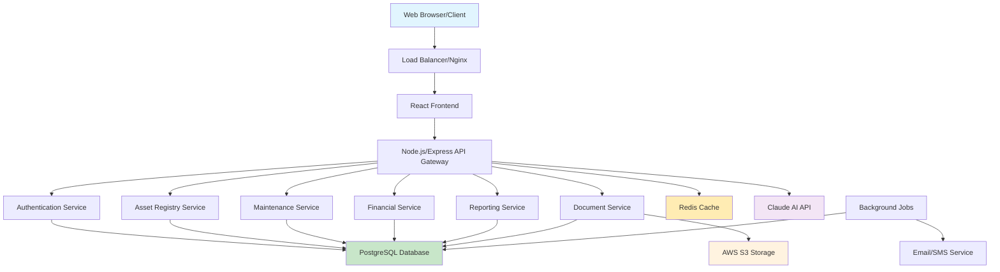
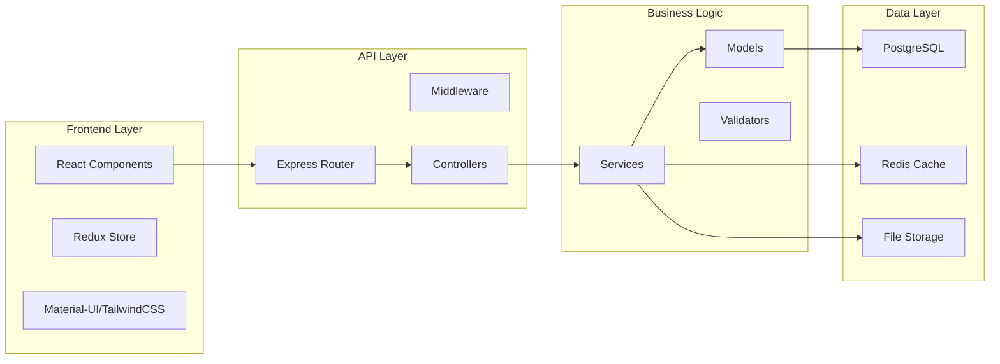
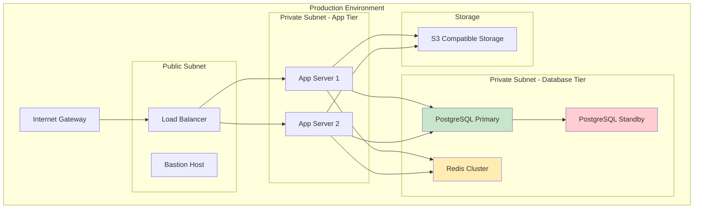

# Municipal Asset Management System
## Technical Manual

**Document Version:** 1.0  
**Date:** December 2024  
**Classification:** Official Use  
**Compliance:** MFMA, GRAP, Municipal Systems Act

---

## Table of Contents

1. [Executive Summary](#executive-summary)
2. [System Architecture](#system-architecture)
3. [Technology Stack](#technology-stack)
4. [Module Documentation](#module-documentation)
5. [API Reference](#api-reference)
6. [Database Schema](#database-schema)
7. [Deployment Guide](#deployment-guide)
8. [Security Considerations](#security-considerations)
9. [Monitoring & Maintenance](#monitoring--maintenance)
10. [Backup & Recovery](#backup--recovery)
11. [Compliance & Governance](#compliance--governance)

---

## Executive Summary

The Municipal Asset Management System (MAMS) is a comprehensive digital platform designed to meet the asset management requirements of South African municipalities in accordance with the Municipal Finance Management Act (MFMA) and Generally Recognised Accounting Practice (GRAP) standards.

### Key Features
- **Asset Registry**: Complete asset lifecycle management
- **Maintenance Management**: Preventive and corrective maintenance scheduling
- **Financial Tracking**: Asset valuation and depreciation management
- **Compliance Reporting**: MFMA and GRAP compliant reporting
- **AI-Powered Insights**: Maintenance recommendations and predictive analytics
- **Document Management**: Centralized asset documentation storage
- **Audit Trail**: Complete transaction history for compliance

### Target Users
- Municipal Asset Managers
- Financial Officers
- Maintenance Teams
- Executive Management
- External Auditors

---

## System Architecture

### High-Level Architecture



### Component Architecture



### Deployment Architecture



---

## Technology Stack

### Backend Technologies

| Component | Technology | Version | Purpose |
|-----------|------------|---------|---------|
| Runtime | Node.js | 18.x LTS | Server runtime environment |
| Framework | Express.js | 4.18+ | Web application framework |
| Language | TypeScript | 5.0+ | Type-safe JavaScript |
| Database | PostgreSQL | 15.x | Primary data storage |
| Cache | Redis | 7.0+ | Caching and session storage |
| Authentication | JWT | - | Token-based authentication |

### Frontend Technologies

| Component | Technology | Version | Purpose |
|-----------|------------|---------|---------|
| Framework | React | 18.x | User interface framework |
| Styling | TailwindCSS | 3.3+ | Utility-first CSS framework |
| UI Components | Material-UI | 5.x | Component library |
| State Management | Redux Toolkit | 1.9+ | Application state management |
| Charts | Chart.js | 4.x | Data visualization |

### Infrastructure & DevOps

| Component | Technology | Purpose |
|-----------|------------|---------|
| Containerization | Docker | Application packaging |
| Orchestration | Docker Compose | Local development |
| Reverse Proxy | Nginx | Load balancing and SSL termination |
| File Storage | AWS S3 Compatible | Document and media storage |
| AI Integration | Claude API | Maintenance insights and recommendations |
| Monitoring | Prometheus + Grafana | System monitoring |
| Logging | ELK Stack | Centralized logging |

---

## Module Documentation

### 1. Asset Registry Module

**Purpose**: Core asset registration, categorization, and lifecycle management

```typescript
// Asset Model Structure
interface Asset {
  id: string;
  assetNumber: string;
  description: string;
  category: AssetCategory;
  subCategory: string;
  location: Location;
  acquisitionDate: Date;
  acquisitionCost: number;
  currentValue: number;
  condition: AssetCondition;
  status: AssetStatus;
  custodian: User;
  specifications: AssetSpecification[];
  maintenanceHistory: MaintenanceRecord[];
  createdAt: Date;
  updatedAt: Date;
}
```

**Key Features**:
- Asset registration with QR code generation
- Location-based asset tracking with GIS integration
- Asset categorization per municipal standards
- Condition assessments and lifecycle tracking
- Transfer and disposal workflows

**File Structure**:
```
src/modules/assets/
├── models/Asset.js
├── controllers/AssetController.js
├── services/AssetService.js
├── routes/assetRoutes.js
└── validators/assetValidators.js
```

### 2. Maintenance Management Module

**Purpose**: Preventive and corrective maintenance scheduling and tracking

```typescript
interface MaintenanceSchedule {
  id: string;
  assetId: string;
  maintenanceType: 'Preventive' | 'Corrective' | 'Emergency';
  scheduledDate: Date;
  frequency: MaintenanceFrequency;
  description: string;
  estimatedCost: number;
  priority: Priority;
  assignedTo: User;
  status: MaintenanceStatus;
  completionDate?: Date;
  actualCost?: number;
  notes?: string;
}
```

**Key Features**:
- Automated maintenance scheduling based on asset specifications
- Work order management with approval workflows
- Resource allocation and technician assignment
- AI-powered maintenance recommendations
- Integration with inventory management

### 3. Financial Tracking Module

**Purpose**: Asset valuation, depreciation, and cost tracking

```typescript
interface AssetValuation {
  id: string;
  assetId: string;
  valuationType: 'Acquisition' | 'Revaluation' | 'Disposal';
  valuationDate: Date;
  originalCost: number;
  accumulatedDepreciation: number;
  netBookValue: number;
  fairValue?: number;
  depreciationMethod: DepreciationMethod;
  usefulLife: number;
  residualValue: number;
  impairmentLoss?: number;
}
```

**Key Features**:
- GRAP-compliant depreciation calculations
- Asset revaluation management
- Cost center allocation
- Financial reporting integration
- Budget planning and tracking

### 4. Reporting & Analytics Module

**Purpose**: Generate compliance reports and asset analytics dashboards

**Report Types**:
- Asset Register (GRAP 17 compliant)
- Depreciation Schedule
- Maintenance Cost Analysis
- Asset Condition Reports
- Disposal Reports
- Insurance Valuations

**Key Features**:
- Automated report generation
- Real-time dashboard analytics
- Export capabilities (PDF, Excel, CSV)
- Scheduled report delivery
- Custom report builder

### 5. User Management Module

**Purpose**: Role-based access control and user administration

```typescript
interface User {
  id: string;
  employeeNumber: string;
  firstName: string;
  lastName: string;
  email: string;
  department: Department;
  role: UserRole;
  permissions: Permission[];
  isActive: boolean;
  lastLogin?: Date;
}

enum UserRole {
  ADMIN = 'admin',
  ASSET_MANAGER = 'asset_manager',
  FINANCIAL_OFFICER = 'financial_officer',
  MAINTENANCE_SUPERVISOR = 'maintenance_supervisor',
  TECHNICIAN = 'technician',
  VIEWER = 'viewer'
}
```

### 6. Document Management Module

**Purpose**: Asset documentation, warranties, and file attachments

**Supported Documents**:
- Purchase orders and invoices
- Warranty certificates
- Insurance policies
- Maintenance manuals
- Safety certificates
- Photos and videos

**Features**:
- Version control for documents
- OCR for searchable text
- Document categorization and tagging
- Automatic document expiry alerts

### 7. Notification System Module

**Purpose**: Automated alerts for maintenance, compliance, and asset lifecycle events

**Notification Types**:
- Maintenance due alerts
- Warranty expiry notifications
- Insurance renewal reminders
- Compliance deadline alerts
- System maintenance notifications

### 8. Audit Trail Module

**Purpose**: Track all asset-related transactions and changes for compliance

**Logged Events**:
- Asset creation, modification, disposal
- Financial transactions and adjustments
- Maintenance activities
- User access and actions
- System configuration changes

---

## API Reference

### Authentication Endpoints

#### POST /api/auth/login
Authenticate user and generate JWT token.

**Request Body**:
```json
{
  "email": "user@municipality.gov.za",
  "password": "password"
}
```

**Response**:
```json
{
  "success": true,
  "token": "eyJhbGciOiJIUzI1NiIsInR5cCI6IkpXVCJ9...",
  "user": {
    "id": "user-123",
    "firstName": "John",
    "lastName": "Doe",
    "role": "asset_manager",
    "permissions": ["read:assets", "write:assets"]
  }
}
```

### Asset Management Endpoints

#### GET /api/assets
Retrieve paginated list of assets with filtering and search.

**Query Parameters**:
```
page: number (default: 1)
limit: number (default: 20)
category: string
status: string
location: string
search: string
```

**Response**:
```json
{
  "success": true,
  "data": {
    "assets": [...],
    "pagination": {
      "page": 1,
      "limit": 20,
      "total": 150,
      "pages": 8
    }
  }
}
```

#### POST /api/assets
Register new municipal asset.

**Request Body**:
```json
{
  "assetNumber": "VEH-001-2024",
  "description": "Toyota Hilux Double Cab",
  "category": "vehicles",
  "subCategory": "light_vehicles",
  "acquisitionDate": "2024-01-15",
  "acquisitionCost": 450000,
  "location": "depot-001",
  "custodian": "user-456"
}
```

#### PUT /api/assets/:id
Update asset information and status.

#### DELETE /api/assets/:id
Decommission or dispose of asset.

### Maintenance Endpoints

#### GET /api/maintenance/schedule
Get maintenance schedules and overdue items.

**Query Parameters**:
```
startDate: string (ISO date)
endDate: string (ISO date)
assetId: string
status: string
priority: string
```

#### POST /api/maintenance/work-order
Create maintenance work order.

**Request Body**:
```json
{
  "assetId": "asset-123",
  "maintenanceType": "Preventive",
  "scheduledDate": "2024-02-15",
  "description": "Annual vehicle service",
  "estimatedCost": 2500,
  "priority": "Medium",
  "assignedTo": "tech-001"
}
```

### Reporting Endpoints

#### GET /api/reports/compliance/:type
Generate compliance reports (MFMA, GRAP, etc.).

**Supported Types**:
- `asset-register`
- `depreciation-schedule`
- `disposal-report`
- `maintenance-summary`

**Query Parameters**:
```
format: 'pdf' | 'excel' | 'csv'
startDate: string
endDate: string
assetCategory: string
```

#### GET /api/reports/financial-summary
Generate financial asset reports and depreciation schedules.

### Document Management Endpoints

#### POST /api/documents/upload
Upload asset-related documents and attachments.

**Request**: Multipart form data
```
file: File
assetId: string
documentType: string
description: string
```

### Analytics Endpoints

#### GET /api/analytics/dashboard
Get asset analytics and KPI data for dashboard.

**Response**:
```json
{
  "totalAssets": 1245,
  "totalValue": 125000000,
  "maintenanceOverdue": 15,
  "averageCondition": 3.2,
  "categoryBreakdown": {...},
  "maintenanceCostTrend": [...],
  "assetAging": {...}
}
```

### Error Handling

All API endpoints follow consistent error response format:

```json
{
  "success": false,
  "error": {
    "code": "VALIDATION_ERROR",
    "message": "Asset number already exists",
    "details": {
      "field": "assetNumber",
      "value": "VEH-001-2024"
    }
  }
}
```

**Common Error Codes**:
- `AUTHENTICATION_REQUIRED` (401)
- `FORBIDDEN` (403)
- `NOT_FOUND` (404)
- `VALIDATION_ERROR` (400)
- `INTERNAL_SERVER_ERROR` (500)

---

## Database Schema

### Core Tables

```mermaid
erDiagram
    USERS ||--o{ ASSETS : manages
    ASSETS ||--o{ MAINTENANCE_SCHEDULES : requires
    ASSETS ||--o{ ASSET_VALUATIONS : valued_at
    ASSETS ||--o{ DOCUMENTS : has
    ASSETS ||--o{ AUDIT_LOGS : tracked_in
    MAINTENANCE_SCHEDULES ||--o{ WORK_ORDERS : generates
    USERS ||--o{ NOTIFICATIONS : receives

    USERS {
        uuid id PK
        string employee_number UK
        string first_name
        string last_name
        string email UK
        string password_hash
        string role
        jsonb permissions
        uuid department_id FK
        boolean is_active
        timestamp created_at
        timestamp updated_at
        timestamp last_login
    }

    ASSETS {
        uuid id PK
        string asset_number UK
        string description
        string category
        string sub_category
        uuid location_id FK
        date acquisition_date
        decimal acquisition_cost
        decimal current_value
        string condition
        string status
        uuid