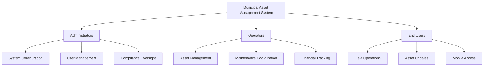
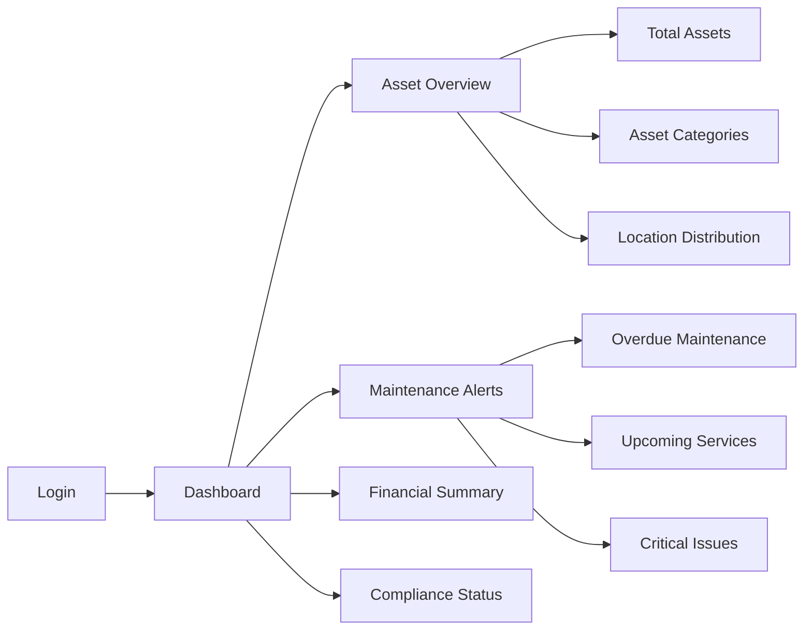
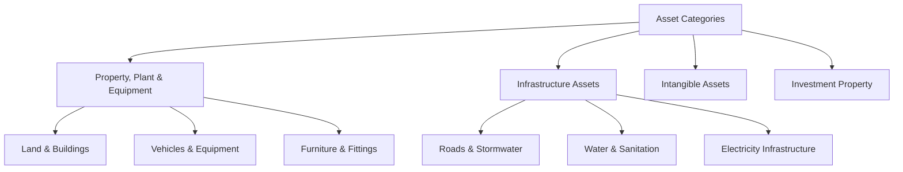
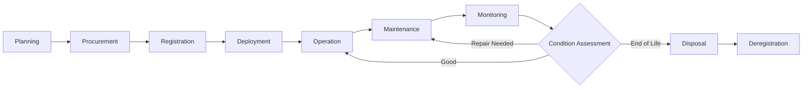
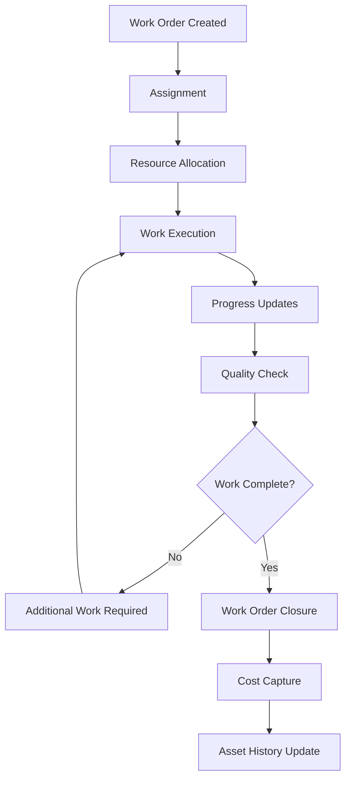
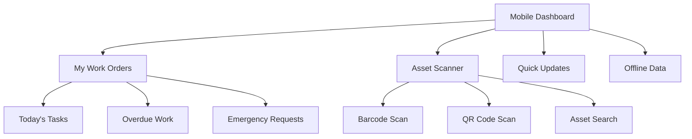

# Municipal Asset Management System
## User Manual

**Version:** 1.0  
**Date:** 2024  
**Prepared for:** South African Municipal Governments  
**Document Type:** User Manual for Tender Submission

---

## Table of Contents

1. [Introduction & Purpose](#1-introduction--purpose)
2. [Getting Started](#2-getting-started)
3. [Administrator User Guide](#3-administrator-user-guide)
4. [Operator User Guide](#4-operator-user-guide)
5. [End-User Guide](#5-end-user-guide)
6. [AI Assistant Usage](#6-ai-assistant-usage)
7. [Troubleshooting](#7-troubleshooting)
8. [Frequently Asked Questions](#8-frequently-asked-questions)

---

## 1. Introduction & Purpose

### 1.1 System Overview

The Municipal Asset Management System (MAMS) is a comprehensive digital solution designed specifically for South African municipalities to effectively manage, track, and report on municipal assets. The system ensures full compliance with the Municipal Finance Management Act (MFMA) and Generally Recognised Accounting Practice (GRAP) standards.

### 1.2 Key Benefits

- **Regulatory Compliance**: Automatic MFMA and GRAP compliant reporting
- **Cost Efficiency**: Optimised maintenance scheduling and asset lifecycle management
- **Transparency**: Real-time asset tracking and comprehensive audit trails
- **Accessibility**: Multi-language support and offline capabilities
- **Intelligence**: AI-powered insights for predictive maintenance and optimization

### 1.3 Target Users

### 1.4 System Requirements

#### Minimum Hardware Requirements
- **Server**: Intel i5 or equivalent, 8GB RAM, 500GB storage
- **Client Devices**: Modern web browser, 4GB RAM recommended
- **Mobile Devices**: Android 8.0+ or iOS 12.0+

#### Software Requirements
- **Operating System**: Windows Server 2016+, Ubuntu 18.04+, or equivalent
- **Database**: PostgreSQL 12+ or SQL Server 2017+
- **Web Browser**: Chrome 90+, Firefox 88+, Edge 90+, Safari 14+

---

## 2. Getting Started

### 2.1 System Access

#### Initial Login
1. Navigate to the system URL provided by your IT administrator
2. Enter your municipal credentials
3. Complete the mandatory password change on first login
4. Accept the terms of use and privacy policy

#### Dashboard Overview

### 2.2 Navigation Structure

The system uses a intuitive navigation structure:

- **Dashboard**: Overview of key metrics and alerts
- **Assets**: Asset registry, tracking, and management
- **Maintenance**: Scheduling, work orders, and service history
- **Financial**: Cost tracking, depreciation, and budgeting
- **Reports**: Compliance reports and analytics
- **Administration**: User management and system settings

### 2.3 Language Selection

The system supports multiple languages:
- English (default)
- Afrikaans
- isiZulu
- isiXhosa
- Sesotho
- Additional local languages as configured

To change language:
1. Click on your profile icon (top right)
2. Select "Language Settings"
3. Choose your preferred language
4. Click "Apply Changes"

### 2.4 Offline Mode

For field operations without internet connectivity:
1. Enable offline mode before leaving the office
2. Sync your assigned assets and work orders
3. Complete field work offline
4. Synchronise data when connectivity is restored

---

## 3. Administrator User Guide

### 3.1 System Administration Overview

Administrators have full system access and are responsible for:
- User account management
- System configuration
- Data integrity
- Compliance oversight
- Integration management

### 3.2 User Management

#### Creating User Accounts

1. Navigate to **Administration > User Management**
2. Click **"Add New User"**
3. Complete the user information form:
   - Full Name
   - Employee Number
   - Email Address
   - Department
   - Contact Information
4. Assign appropriate role and permissions
5. Set temporary password
6. Click **"Create User"**

#### Role-Based Access Control

The system includes predefined roles:

| Role | Permissions | Typical Users |
|------|-------------|---------------|
| **System Administrator** | Full system access | IT Manager |
| **Asset Manager** | Asset lifecycle, maintenance, reporting | Asset Management Department |
| **Finance Officer** | Financial tracking, depreciation, budgeting | Finance Department |
| **Maintenance Supervisor** | Work orders, scheduling, technician management | Technical Services |
| **Field Technician** | Mobile access, work order updates | Field Workers |
| **Viewer** | Read-only access to assigned assets | Department Heads |

#### User Account Maintenance

**Deactivating Users:**
1. Go to **Administration > User Management**
2. Search for the user account
3. Click **"Edit User"**
4. Change status to "Inactive"
5. Save changes

**Password Reset:**
1. Select user account
2. Click **"Reset Password"**
3. System generates temporary password
4. Send credentials securely to user

### 3.3 System Configuration

#### Municipal Profile Setup

1. Navigate to **Administration > Municipal Profile**
2. Complete organisation details:
   - Municipality Name
   - Physical Address
   - Contact Information
   - Municipal Manager Details
   - Financial Year Configuration

#### Asset Categories Configuration

Configure asset categories aligned with GRAP standards:

#### Depreciation Configuration

Set up depreciation methods per GRAP requirements:
1. Go to **Administration > Depreciation Settings**
2. Configure depreciation methods:
   - Straight-line method
   - Diminishing balance method
   - Units of production method
3. Set useful life periods per asset category
4. Configure residual value percentages

### 3.4 Integration Management

#### Financial System Integration

1. Navigate to **Administration > Integrations**
2. Select **"Financial System"**
3. Configure connection parameters:
   - System type (SAP, Pastel, etc.)
   - Connection credentials
   - Data mapping settings
4. Test connection
5. Schedule automatic synchronisation

#### GPS Integration Setup

1. Go to **Administration > GPS Integration**
2. Configure GPS provider settings
3. Set location update frequencies
4. Define geofencing parameters
5. Test location services

### 3.5 Backup and Data Management

#### Automated Backups

1. Navigate to **Administration > Backup Settings**
2. Configure backup schedule:
   - Daily incremental backups
   - Weekly full backups
   - Monthly archive backups
3. Set retention policies
4. Configure backup storage location

#### Data Import/Export

**Bulk Asset Import:**
1. Download the asset import template
2. Complete template with asset data
3. Validate data format and completeness
4. Upload file via **Assets > Import Assets**
5. Review and approve import results

**Data Export:**
1. Navigate to required module
2. Apply filters if needed
3. Click **"Export Data"**
4. Select export format (Excel, CSV, PDF)
5. Download generated file

### 3.6 Compliance Monitoring

#### MFMA Compliance Dashboard

Monitor compliance status across key areas:
- Asset register completeness
- Depreciation calculations
- Insurance coverage
- Maintenance schedules
- Disposal procedures

#### Automated Compliance Alerts

Configure alerts for:
- Missing asset documentation
- Overdue maintenance
- Insurance expiry
- Warranty lapses
- Disposal approval requirements

---

## 4. Operator User Guide

### 4.1 Operator Role Overview

Operators are responsible for day-to-day asset management activities including:
- Asset registration and updates
- Maintenance scheduling and coordination
- Financial tracking and reporting
- Work order management
- Performance monitoring

### 4.2 Asset Management

#### Asset Registration

**Adding New Assets:**

1. Navigate to **Assets > Asset Register**
2. Click **"Add New Asset"**
3. Complete the asset details form:

**Basic Information:**
- Asset Description
- Asset Category
- Serial Number
- Barcode/QR Code
- Acquisition Date
- Supplier Details

**Financial Information:**
- Purchase Price
- Depreciation Method
- Useful Life
- Residual Value
- Funding Source

**Location and Condition:**
- Current Location
- GPS Coordinates
- Physical Condition
- Custody Department

**Documentation:**
- Purchase Order
- Invoice
- Warranty Certificate
- User Manual
- Insurance Policy

4. Generate and print asset tags
5. Save asset record

#### Asset Lifecycle Management

#### Asset Updates

**Modifying Asset Information:**
1. Search for asset using barcode, description, or asset number
2. Click **"Edit Asset"**
3. Update required fields
4. Add update comments
5. Save changes (creates audit trail)

**Asset Transfers:**
1. Select asset for transfer
2. Click **"Transfer Asset"**
3. Specify new location/department
4. Add transfer reason
5. Obtain approvals if required
6. Complete transfer

#### Asset Tagging and Scanning

**Physical Asset Tagging:**
1. Print barcode/QR code labels
2. Attach labels securely to assets
3. Verify scanability
4. Update asset location in system
5. Photograph asset for reference

**Mobile Scanning:**
- Use mobile app to scan asset tags
- Automatically populates asset information
- Update location and condition
- Add photos and notes
- Sync with main system

### 4.3 Maintenance Management

#### Preventive Maintenance

**Creating Maintenance Schedules:**

1. Go to **Maintenance > Preventive Maintenance**
2. Click **"Create Schedule"**
3. Define maintenance parameters:
   - Asset or asset group
   - Maintenance type
   - Frequency (time-based or usage-based)
   - Resource requirements
   - Estimated duration
   - Safety procedures

**Maintenance Types by Asset Category:**

| Asset Category | Maintenance Types | Frequency |
|----------------|------------------|-----------|
| **Vehicles** | Service, Inspection, Repairs | Monthly/Mileage-based |
| **Buildings** | Cleaning, HVAC, Electrical | Quarterly |
| **Equipment** | Calibration, Lubrication, Parts replacement | As per manufacturer |
| **Infrastructure** | Inspection, Cleaning, Repairs | Semi-annually |

#### Work Order Management

**Creating Work Orders:**

1. Navigate to **Maintenance > Work Orders**
2. Click **"Create Work Order"**
3. Complete work order details:
   - Asset identification
   - Work type (preventive/corrective)
   - Priority level
   - Description of work required
   - Estimated resources
   - Target completion date
   - Assigned technician

**Work Order Workflow:**

#### Maintenance Scheduling Optimization

Use AI assistant for:
- Optimal maintenance timing
- Resource allocation
- Cost-effective scheduling
- Downtime minimization

### 4.4 Financial Management

#### Cost Tracking

**Recording Maintenance Costs:**
1. Open completed work order
2. Click **"Add Costs"**
3. Enter cost details:
   - Labour hours and rates
   - Material costs
   - External service provider costs
   - Equipment hire costs
4. Attach supporting documentation
5. Submit for approval

**Asset Financial Overview:**
- Historical costs
- Year-to-date expenses
- Budget allocation
- Variance analysis
- ROI calculations

#### Depreciation Management

**Automated Depreciation:**
- System calculates monthly depreciation
- Updates asset book values
- Generates depreciation reports
- Maintains compliance with GRAP

**Manual Depreciation Adjustments:**
1. Navigate to **Financial > Depreciation**
2. Select asset for adjustment
3. Provide justification for adjustment
4. Enter adjusted values
5. Submit for approval

#### Budget Planning

**Annual Budget Preparation:**
1. Go to **Financial > Budget Planning**
2. Review historical spending patterns
3. Use AI recommendations for budget allocation
4. Set budget limits per department/category
5. Submit budget for approval

### 4.5 Reporting and Analytics

#### Standard Reports

**Available Reports:**
- Asset Register (GRAP compliant)
- Depreciation Schedule
- Maintenance History
- Cost Analysis
- Insurance Register
- Disposal Register

**Generating Reports:**
1. Navigate to **Reports > Standard Reports**
2. Select required report type
3. Set date ranges and filters
4. Choose output format
5. Generate and download report

#### Custom Analytics

**Creating Custom Dashboards:**
1. Go to **Reports > Analytics**
2. Select **"Create Dashboard"**
3. Choose data sources
4. Add charts and metrics
5. Configure refresh schedules
6. Save and share dashboard

#### Performance Indicators

Key Performance Indicators (KPIs) tracked:
- Asset utilization rates
- Maintenance cost per asset
- Downtime percentage
- Compliance score
- Budget variance

---

## 5. End-User Guide

### 5.1 End-User Overview

End-users typically include field technicians, department staff, and other municipal employees who interact with assets on a daily basis. Their primary functions include:
- Asset condition reporting
- Basic maintenance updates
- Mobile asset scanning
- Work order execution

### 5.2 Mobile Application Usage

#### Mobile App Installation

1. Download "Municipal Asset Manager" from:
   - Google Play Store (Android)
   - Apple App Store (iOS)
2. Install the application
3. Launch app and enter municipality code
4. Login with your system credentials
5. Complete initial data synchronization

#### Mobile Dashboard

#### Asset Scanning and Updates

**Scanning Asset Tags:**
1. Open mobile app
2. Tap **"Asset Scanner"**
3. Point camera at barcode/QR code
4. Asset details appear automatically
5. Update information as needed:
   - Current condition
   - Location verification
   - Add photos
   - Record notes

**Condition Assessment Scale:**
- **Excellent (5)**: Like new condition
- **Good (4)**: Minor wear, fully functional
- **Fair (3)**: Some wear, requires