# Municipal Asset Management System
## A Simple Visual Guide for Everyone

Think of this system like a **digital filing cabinet** that keeps track of everything your municipality owns - from office chairs to fire trucks. Just like you might use labels and folders to organize your home, this system uses barcodes and digital tags to organize municipal assets.

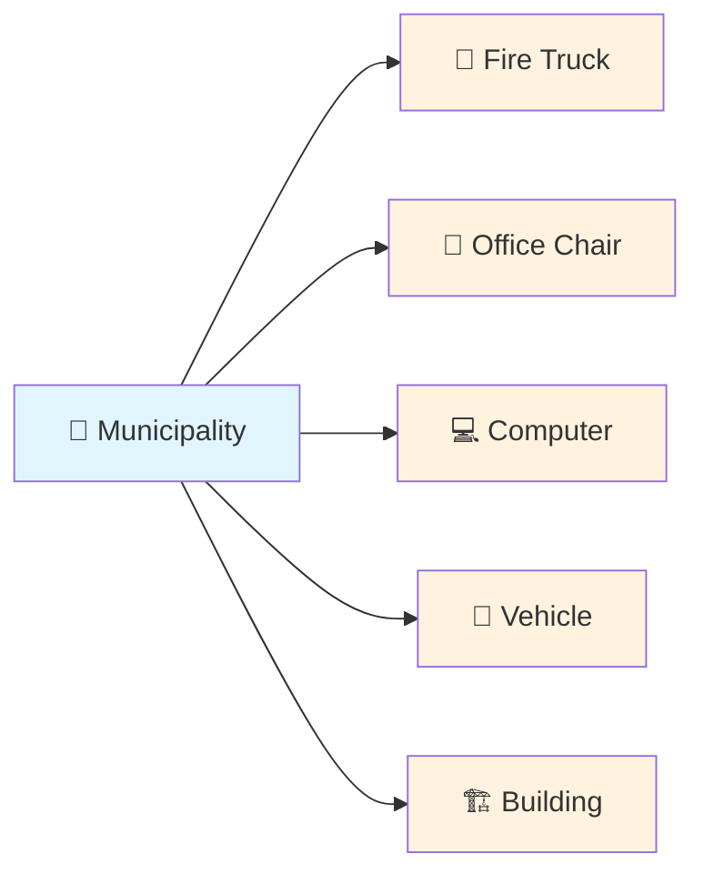

---

## What Does This System Actually Do?

Imagine you're managing a huge household with thousands of items. You'd want to know where everything is, when it needs fixing, and how much it's worth. That's exactly what this system does for your municipality!

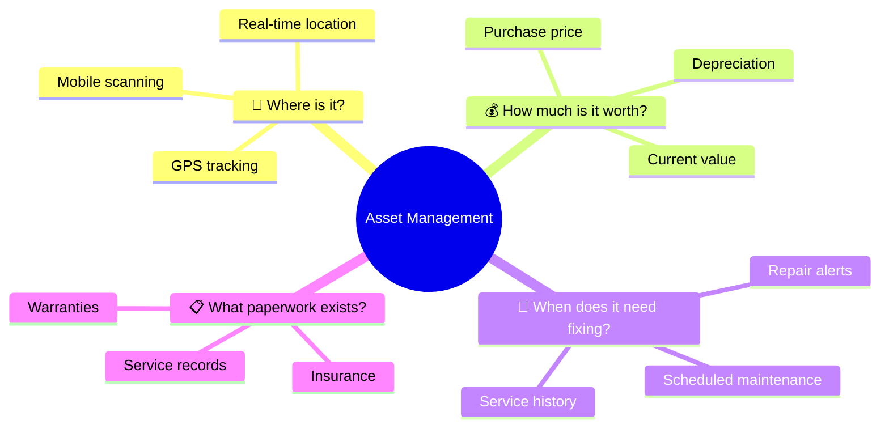

---

## The Asset Lifecycle - Like a Car's Journey

Just like buying a car, using it, maintaining it, and eventually selling it, every municipal asset follows the same journey:

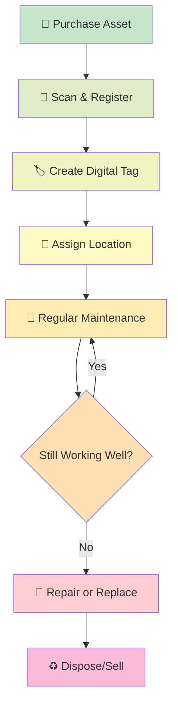

---

## How Scanning Works - Like Shopping at Pick n Pay

Remember how cashiers scan barcodes at the grocery store? This system works the same way, but for municipal assets:

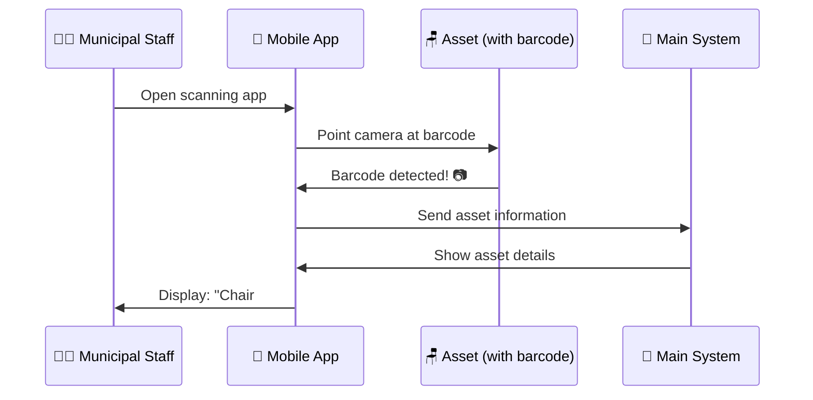

When someone scans an asset, they instantly see its "story" - where it came from, when it was last serviced, and what condition it's in.

---

## Maintenance Alerts - Like Your Car's Service Reminder

Just like your car tells you when it needs an oil change, this system reminds staff when assets need attention:

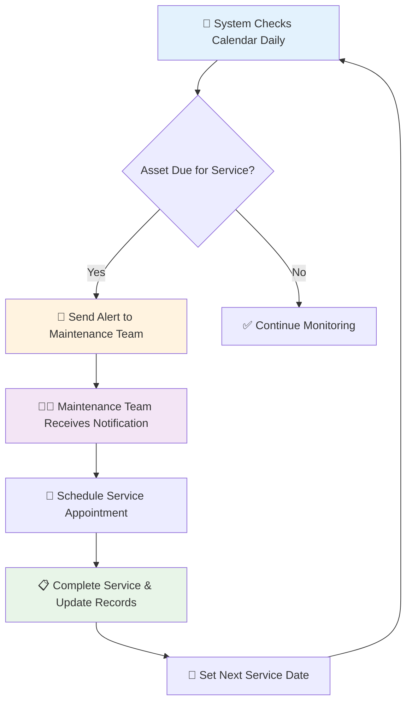

---

## Who Can See What? - Role-Based Access

Think of this like different keys for different doors in your house. Not everyone needs access to everything:

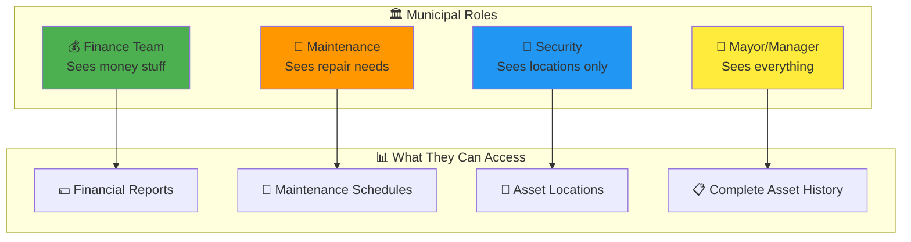

---

## What Happens When... Someone Finds a Missing Asset?

Let's say a municipal vehicle was "lost" for months. Here's how the system helps find and track it:

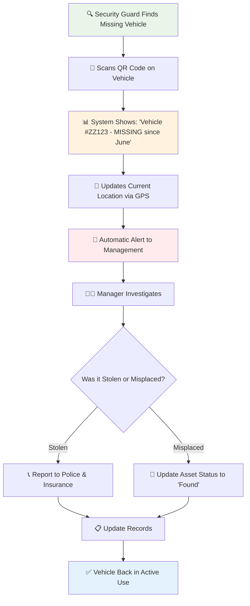

---

## Mobile App in Action - Like Using WhatsApp for Assets

The mobile app is designed to be as easy as using WhatsApp. Here's what a maintenance worker sees:

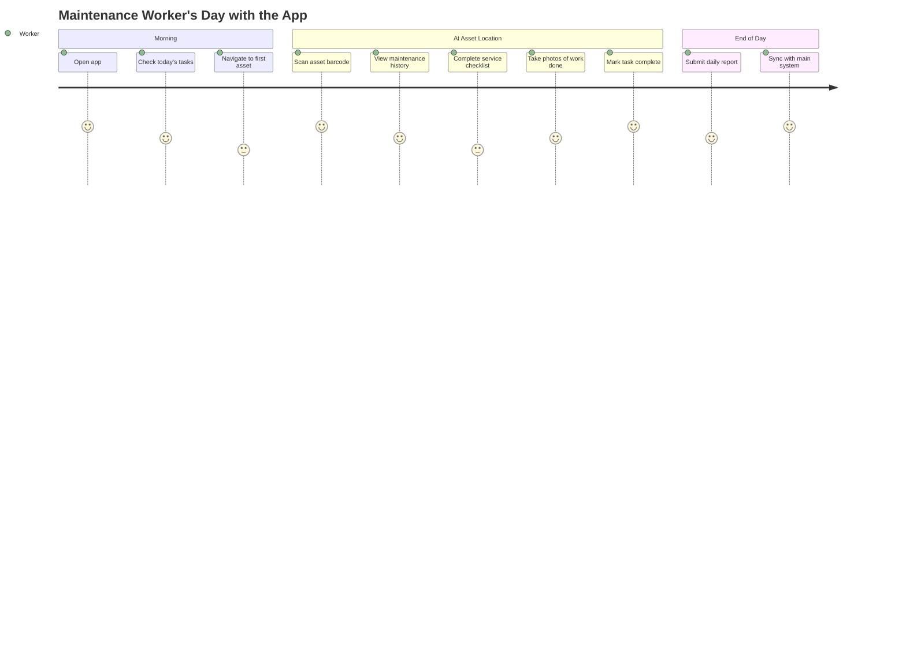

Even when there's no internet connection, the app works offline and syncs everything when connection returns - like how WhatsApp messages send when you get signal back.

---

## Financial Tracking Made Simple

Think of this like tracking your household budget, but for the entire municipality:

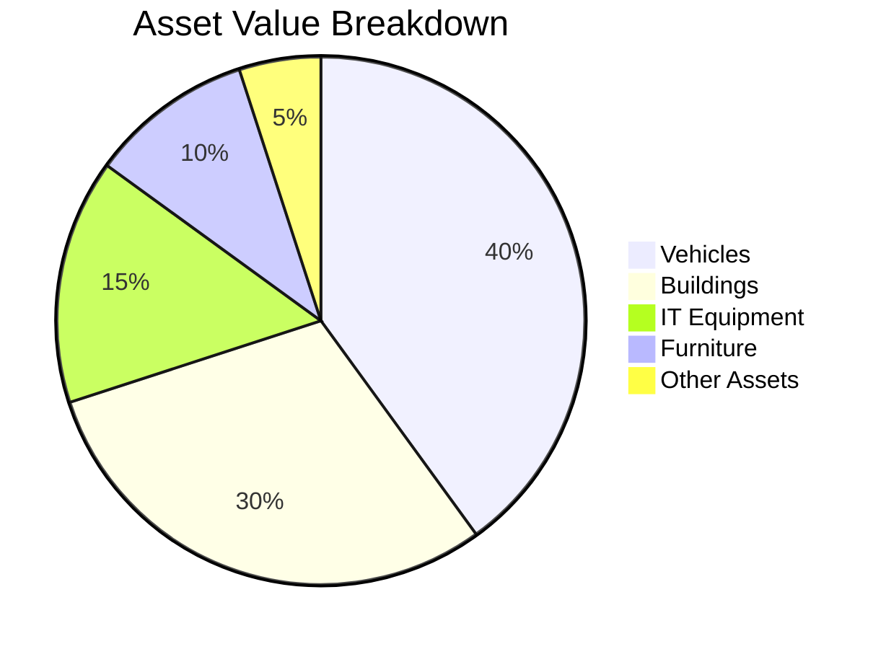

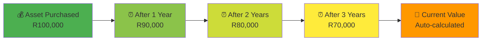

The system automatically calculates how much each asset is worth today, just like how your car loses value over time.

---

## Reporting for Compliance - Meeting Government Requirements

South African municipalities must follow specific rules (MFMA and GRAP). This system creates the required reports automatically:

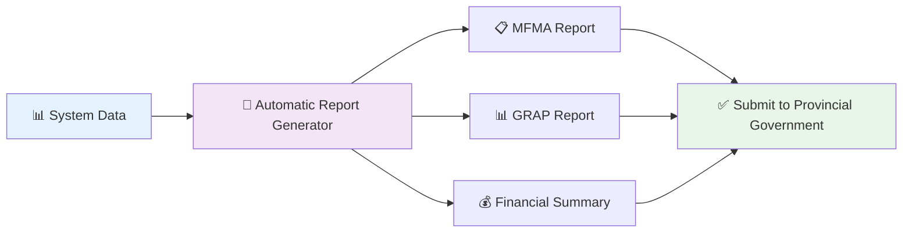

Instead of spending weeks creating reports manually, the system generates them in minutes - like having a smart assistant that never makes mistakes.

---

## What This Means for Your Municipality

This system transforms asset management from a nightmare into a smooth operation:

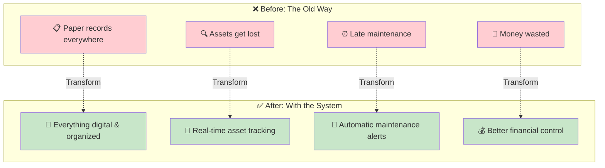

Think of it as upgrading from a flip phone to a smartphone - suddenly everything becomes easier, faster, and more reliable. Your municipality will save money, provide better services to residents, and meet all government requirements effortlessly.

The best part? Staff can learn to use it in just a few days, and the system grows with your municipality's needs. It's like having a super-efficient assistant that never sleeps and never forgets anything!